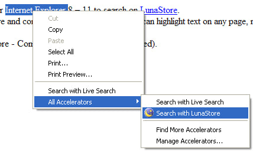
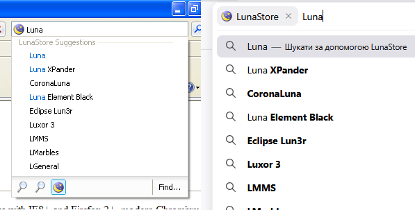

# LunaStore Search Extensions

## IE Accelerator
*Live demo: http://supermaxusa.w10.site/lunasearch/ie-accel/*

An [accelerator](https://learn.microsoft.com/en-us/previous-versions/windows/internet-explorer/ie-developer/platform-apis/cc289775(v=vs.85)) for Internet Explorer 8 &mdash; 11, adds an "Search with LunaStore" option to the context menu.



## OpenSearch Extension
*Live demo: http://supermaxusa.w10.site/lunasearch/opensearch/*

> [!NOTE]
> Live demo version doesn't support search suggestions. You can deploy your local server for that, see the guide below.

An OpenSearch-compatible provider, should be compatible with most browsers from the last 20 years (Internet Explorer 7+, Firefox 2+).



### Local server
How to run:
1. Install [Deno](https://deno.com/) and clone this repo.
2. Run this command to start the server:
```sh
deno serve --allow-env --allow-net ./opensearch/os-server.ts
```
3. Go to the server URL (`http://localhost:8000` by default), remove the old search provider from your browser settings (if you already added it from the live demo), and follow the guide on the page.

Environment settings:
 - `LUNASTORE_API_BASE`: URL base for LunaStore API, required V2 API support (`https://api.lunastore.app` by default)
 - `LUNASTORE_SITE_BASE`: URL base for LunaStore site (`http://lunastore.app` by default)
 - `SEARCH_LIMIT`: app list search limit (`10` by default)
 - `CACHE_TTL`: Time-To-Live value for cache in seconds (`300` by default)
 - `API_LANGUAGE`: locale for LunaStore API (`en` by default)
